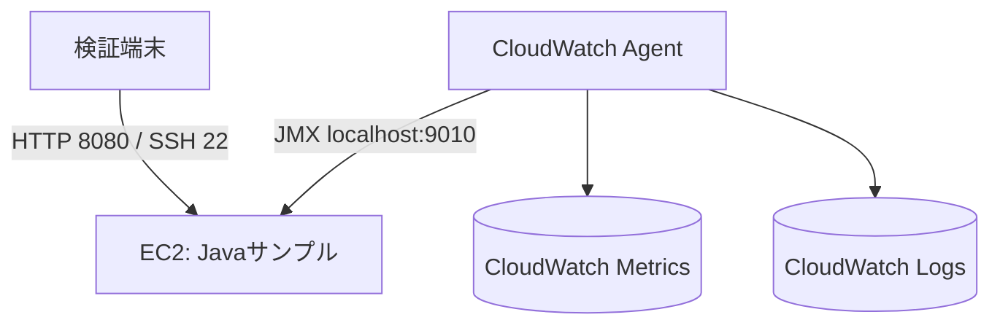

# Deployment Architecture

## Status

Draft

## Environments

| Environment | Purpose | Deployment Target |
| --- | --- | --- |
| Local | 実装、単体試験、`jcmd`による事前確認 | WSL2 Ubuntu 22.04 LTS、OpenJDK 21 |
| Verification | Code Cache負荷試験とCloudWatch監視 | Ubuntu Server 24.04 LTS EC2（x86_64）、OpenJDK 21 |

## Deployment Diagram

## Network and Ports

| Source | Destination | Protocol / Port | Purpose |
| --- | --- | --- | --- |
| 検証端末の固定IP | EC2 | TCP 22 | SSH運用 |
| 検証端末の固定IP | EC2 | TCP 8080 | HTTP負荷生成 |
| CloudWatch Agent | JVM（同一EC2） | TCP 9010 | JMXメトリクス収集 |
| EC2 | AWS API | HTTPS 443 | メトリクス・ログ送信 |

JMX 9010はlocalhostだけにバインドし、Security Groupでは公開しない。

## Related Documents

- [Deployment Operation](../operations/deployment.md)
