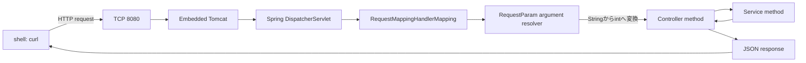
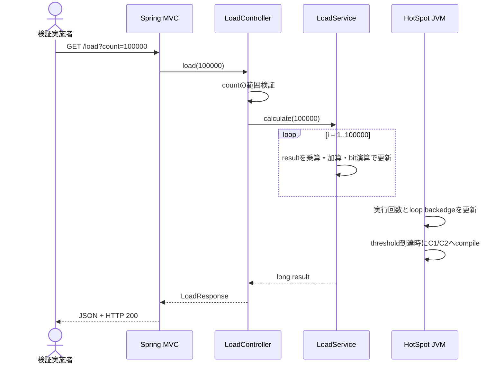
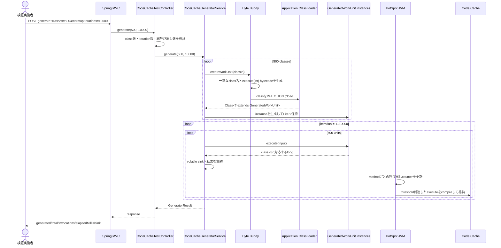
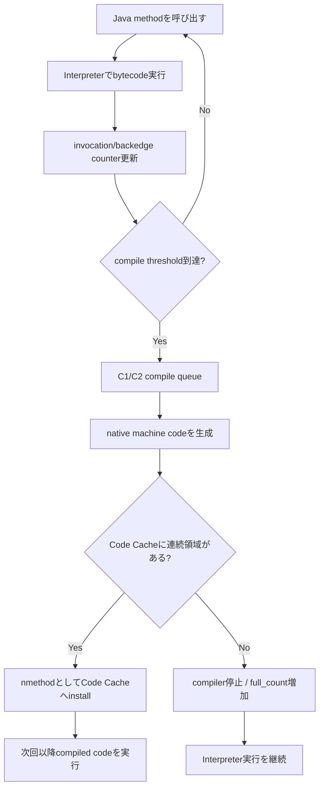
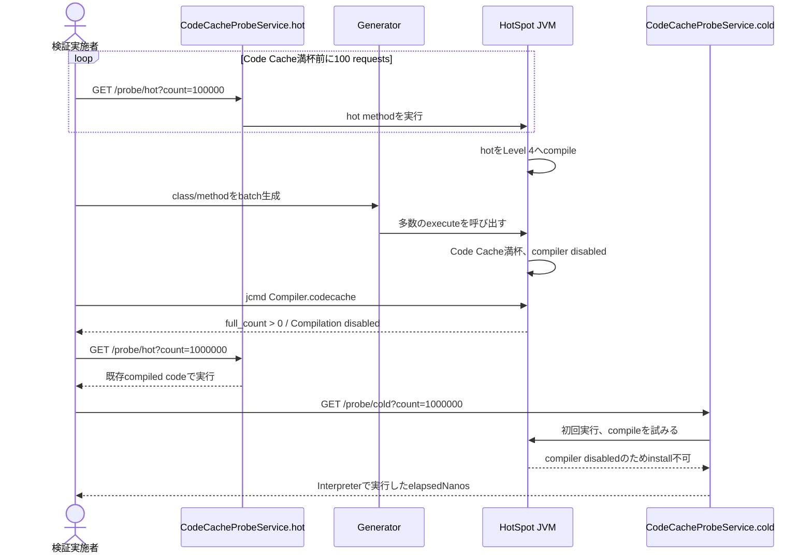
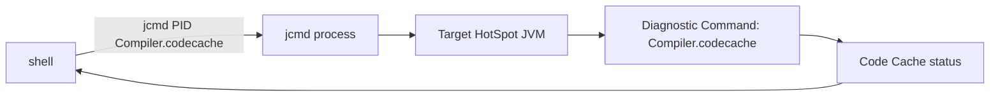
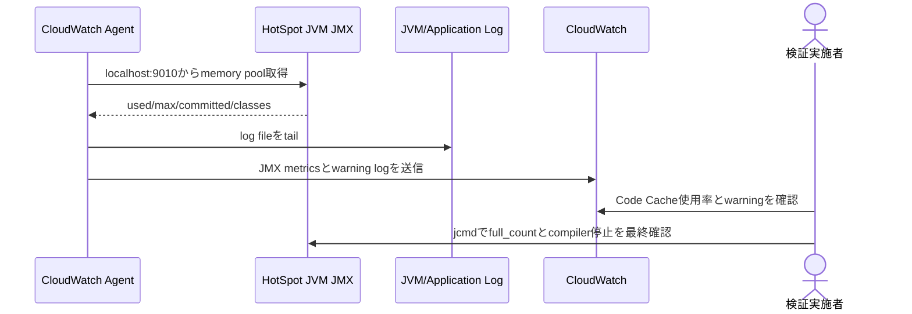

# Runtime Flow

## Status

Active (Local), Draft (CloudWatch)

## Purpose

shellから入力したHTTP requestがどのJavaコードを呼び、JVMがどの時点でJITコンパイルし、
Code Cacheへmachine codeを格納するかを示す。

重要な前提:

- JavaコードはメソッドをHotまたはColdに設定しない。
- HotSpot JVMが実行回数、loop backedge、profileを基にJITコンパイルを判断する。
- `hot`と`cold`は検証用のメソッド名であり、呼び出す順番によって実行履歴を分ける。
- Code Cache満杯の判定は現在のJava API内では行わず、検証実施者が`jcmd`で確認する。

## Entry Points and Java Targets

| HTTP Input | Spring Controller Method | Next Java Call |
| --- | --- | --- |
| `GET /load?count=N` | `LoadController.load(int)` | `LoadService.calculate(int)` |
| `POST /code-cache/generator/generate?classes=N&warmupIterations=K` | `CodeCacheTestController.generate(int, int)` | `CodeCacheGeneratorService.generate(int, int)` |
| `POST /code-cache/generator/warm?iterations=K` | `CodeCacheTestController.warm(int)` | `CodeCacheGeneratorService.warmAll(int)` |
| `GET /code-cache/generator/status` | `CodeCacheTestController.status()` | `CodeCacheGeneratorService.status()` |
| `GET /code-cache/probe/hot?count=N` | `CodeCacheTestController.hot(int)` | `CodeCacheProbeService.hot(int)` |
| `GET /code-cache/probe/cold?count=N` | `CodeCacheTestController.cold(int)` | `CodeCacheProbeService.cold(int)` |

検証用`/code-cache/**`は`code-cache-test` profileを有効にしたときだけSpringへ登録される。

## How HTTP Input Becomes a Java Call



例:

```bash
curl 'http://localhost:8080/code-cache/probe/hot?count=100000'
```

変換順:

```text
HTTP query string "count=100000"
  -> Springが文字列"100000"をint 100000へ変換
  -> CodeCacheTestController.hot(100000)
  -> CodeCacheProbeService.hot(100000)
```

`count=abc`のように`int`へ変換できない入力は、Controller methodへ到達する前にSpringがHTTP 400を返す。
数値変換後の範囲はControllerの`validateRange`で確認する。

## Basic `/load` Flow

最初に作成した通常JIT確認用のフロー。



同じ`LoadService.calculate`を繰り返すため、Level 4到達後は同じcompiled codeを再利用する。
このフローだけではCode Cache使用量は増え続けない。

## Generator Input

例:

```bash
curl -X POST \
  'http://localhost:8080/code-cache/generator/generate?classes=500&warmupIterations=10000'
```

| Input | Java Value | Effect |
| --- | ---: | --- |
| `classes=500` | `classes = 500` | 異なるclassと`execute` methodを500個生成 |
| `warmupIterations=10000` | `warmupIterations = 10000` | 生成した各methodを10,000回呼ぶ |

総method呼び出し数:

```text
classes * warmupIterations
= 500 * 10000
= 5,000,000 invocations
```

## Generator Call Flow



### Generation and Warm-up Order

`generate()`は、最初に指定数すべてのclassを生成し、その後に全methodをround-robinでwarm-upする。

```text
Phase 1: class生成
  WorkUnit00000001を生成
  WorkUnit00000002を生成
  ...
  WorkUnit00000500を生成

Phase 2: warm-up
  iteration 1: Unit1, Unit2, ... Unit500
  iteration 2: Unit1, Unit2, ... Unit500
  ...
  iteration 10000: Unit1, Unit2, ... Unit500
```

Unit1を10,000回実行してからUnit2へ進む方式ではない。
各methodのcounterが並行して増え、JVMのcompile queueへ順次投入される。

## What Byte Buddy Generates

共通interface:

```java
public interface GeneratedWorkUnit {
    long execute(int input);
}
```

runtimeに生成されるbytecodeをJavaソース風に表すと次のようになる。

```java
class WorkUnit00000001 implements GeneratedWorkUnit {
    public long execute(int input) {
        return 1L;
    }
}

class WorkUnit00000002 implements GeneratedWorkUnit {
    public long execute(int input) {
        return 2L;
    }
}
```

クラス名とmethod identityが異なるため、HotSpotは各`execute`を別のJITコンパイル対象として扱う。
1 methodあたりのmachine codeは小さくても、数百・数千method分がCode Cacheへ蓄積する。

## JVM Compilation Flow



Javaコードが`Code Cacheへ格納する`命令を直接実行するわけではない。
Javaコードはmethod呼び出しを発生させ、JVMがcounterとprofileを基にcompile・格納を判断する。

## Hot/Cold Control Flow

HotとColdは同じ計算式を持つが、別のJava methodである。

```text
CodeCacheProbeService.hot(int)
CodeCacheProbeService.cold(int)
```

JVMはmethodごとに別の実行counterとcompiled codeを管理する。



### Who Decides When to Call Cold

現在のJavaコードはCode Cache満杯を判定して、自動的にColdを呼ぶ処理を持たない。

検証実施者が次の順序を制御する。

1. Hotだけをwarm-upする。
2. Generatorを小さいbatchで実行する。
3. 各batch後に`jcmd`で確認する。
4. `Compilation: disabled`を確認する。
5. その直後にCold APIを初めて呼ぶ。

1,000 classを一度に指定した場合、warm-up処理の途中でCode Cacheが満杯になる可能性がある。
満杯地点を細かく確認する場合は、50～100 classずつ追加して毎回`jcmd`を実行する。

## `jcmd` Call Flow

`jcmd`はHTTP APIやSpring Controllerを呼ばない。別processから対象HotSpot JVMへ診断commandを送る。



```bash
jcmd -l
jcmd "$PID" Compiler.codecache
jcmd "$PID" Compiler.codelist
```

- `Compiler.codecache`: 容量、使用量、full/stop/restart状態を返す。
- `Compiler.codelist`: 現在Code Cacheにあるcompiled methodを返す。
- `Compiler.queue`: 現在のC1/C2 compile queueを返す。

## End-to-End Test Order

```text
1. JVMを10MB + code-cache-test profileで起動
2. jcmdでPIDとbaselineを取得
3. Hot APIを100回呼ぶ
4. codelistでHotのLevel 4を確認
5. Generator APIを50～500 class単位で呼ぶ
6. 各batch後にCompiler.codecacheを確認
7. full_count > 0 かつ Compilation disabledを確認
8. Hot APIを測定
9. Cold APIを初めて測定
10. codelistにHotがありColdがないことを確認
11. Hot/Coldのresult一致とelapsedNanos差を比較
```

## CloudWatch Flow



CloudWatch標準JMX metricは`full_count`を直接返さないため、CloudWatchのpool使用率・warning logと
`jcmd`の結果を組み合わせる。

## Code References

- [LoadController](../../app/src/main/java/com/example/codecache/api/LoadController.java)
- [LoadService](../../app/src/main/java/com/example/codecache/service/LoadService.java)
- [CodeCacheTestController](../../app/src/main/java/com/example/codecache/codecache/CodeCacheTestController.java)
- [CodeCacheGeneratorService](../../app/src/main/java/com/example/codecache/codecache/CodeCacheGeneratorService.java)
- [CodeCacheProbeService](../../app/src/main/java/com/example/codecache/codecache/CodeCacheProbeService.java)
- [GeneratedWorkUnit](../../app/src/main/java/com/example/codecache/codecache/GeneratedWorkUnit.java)

## Related Documents

- [System Context](system-context.md)
- [API](../api/index.md)
- [Code Cache Test API](../api/code-cache-test-api.md)
- [Code Cache Overflow Test](../performance/code-cache-overflow-test.md)
- [EC2 and CloudWatch Verification](../performance/ec2-cloudwatch-verification.md)
