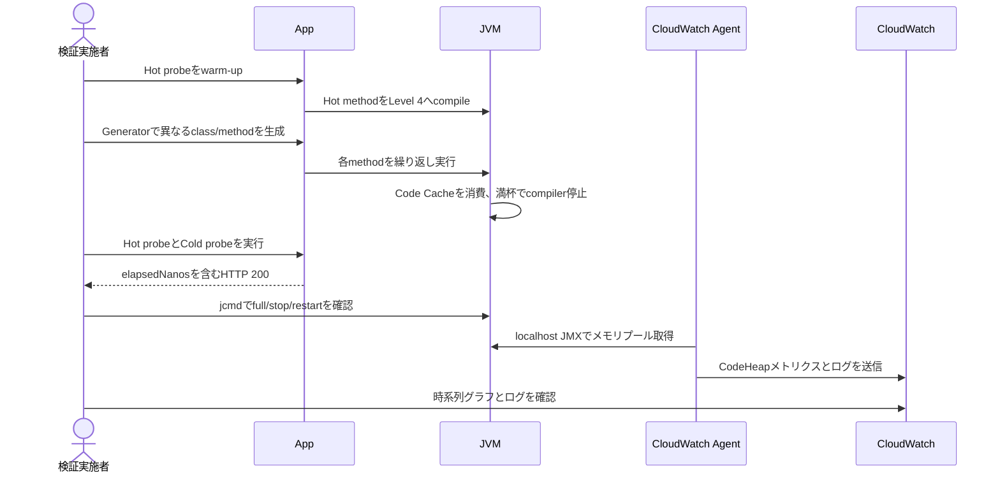

# Runtime Flow

## Status

Active (Local), Draft (CloudWatch)

## Overview

Generatorで多数の異なるmethodをJITコンパイルし、Code Cache満杯前後のHot/Cold probeを比較する。

## Main Flow

## Related Documents

- [System Context](system-context.md)
- [API](../api/index.md)
- [Code Cache Test API](../api/code-cache-test-api.md)
