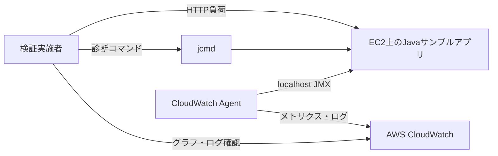

# System Context

## Status

Draft

## Overview

予定している検証環境の境界を記載する。実装完了後にActiveへ変更する。

## Users

| User | Purpose |
| --- | --- |
| 検証実施者 | 負荷生成、Code Cache確認、CloudWatch監視、結果記録 |

## External Systems

| System | Purpose | Protocol |
| --- | --- | --- |
| Amazon EC2 | JavaサンプルアプリとCloudWatch Agentの実行 | SSH、HTTP |
| Amazon CloudWatch | JVMメトリクス、ログ、アラームの管理 | AWS API（HTTPS） |
| JMX | JVMメモリプールの取得 | localhost TCP 9010（予定） |

## Related Documents

- [Current State](current-state.md)
- [Runtime Flow](runtime-flow.md)
- [Deployment](deployment.md)
